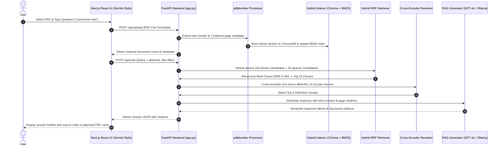

# Cortex RAG Assistant 🚀

A high-performance **Hybrid Retrieval-Augmented Generation (RAG)** Document Intelligence Platform with a sleek **Gemini-style Next.js (React)** frontend and **FastAPI** backend. Combines dense vector retrieval (ChromaDB), sparse keyword search (BM25Okapi), Reciprocal Rank Fusion (RRF 20+20 → 15), Cross-Encoder reranking (`ms-marco-MiniLM-L-6-v2` → top 4), and structured context generation with page-level citations.

> [!WARNING]
> **Project Disclaimer & Status:** This project is actively under development. Response synthesis and offline fallback generation are currently being fine-tuned. For optimal natural language answers, please configure your `OPENAI_API_KEY` or connect a local `Ollama` instance in the UI Model Settings modal.

---

## 🏗 System Architecture & Workflow

```
Browser (Next.js React UI - Gemini Style)
       │
       ▼ (REST API / CORS)
FastAPI Backend (app.py :8000)
       │
       ├── Document Ingestion ──► pdfplumber (Text Extraction & 1-indexed Page Tracking)
       │                         └── HybridIndexer (ChromaDB Vector Store + BM25Okapi Sparse Index)
       │
       └── Query Processing
             ├── Query Rewriter (GPT-4o / Ollama)
             ├── HybridRetriever (Reciprocal Rank Fusion: 20 Dense + 20 Sparse → Top 15 Candidates)
             ├── CandidateReranker (Cross-Encoder ms-marco-MiniLM-L-6-v2 → Top 4 Definitive Chunks)
             └── RAGGenerator (Context-stuffed Prompting + Structured Page Citations)
```

---

## 🔄 How a Conversation Works



---

## 📦 Components Breakdown

The system is built with modular components split across backend processing and the frontend user interface:

### 1. FastAPI Backend Service (`app.py`)
Provides REST API endpoints for seamless UI integration:
- `POST /api/upload`: Saves PDF documents to `./source_documents`, extracts text chunks via `pdf_processor.py`, and indexes into ChromaDB & BM25Okapi.
- `POST /api/chat`: Runs query rewriting, hybrid dense+sparse RRF retrieval, Cross-Encoder reranking, and context generation with optional `attached_files` scoping.
- `GET /api/documents` & `DELETE /api/documents/{filename}`: Manages document knowledge base inventory.
- `POST /api/config`: Dynamically toggles LLM providers (OpenAI / Ollama) and updates API keys.

### 2. High-Fidelity PDF Processor (`pdf_processor.py`)
- Extracts text page-by-page preserving 1-indexed page boundaries using `pdfplumber`.
- Chunks text into 1,000-token blocks with 150-token overlap.
- Attaches metadata: `file_name`, `page_number`, `chunk_id`.

### 3. Dual Hybrid Indexer (`hybrid_indexer.py`)
- **Dense Store**: ChromaDB vector store powered by `text-embedding-3-small` (or local `all-MiniLM-L6-v2`).
- **Sparse Store**: In-memory `BM25Okapi` index via `rank_bm25`.

### 4. Reciprocal Rank Fusion Retriever (`hybrid_retriever.py`)
- Queries dense and sparse indexes simultaneously (top 20 each).
- Re-scores candidates using **Reciprocal Rank Fusion (RRF, k=60)** to select top 15 candidate chunks.
- Applies filename boosting (`+1.0` RRF score) when queries explicitly target specific PDF names.

### 5. Query Rewriter & Cross-Encoder Reranker (`query_reranker.py`)
- **Query Rewriter**: Expands raw user prompts into search-optimized queries.
- **Cross-Encoder Reranker**: Re-evaluates `(query, passage)` relevance using `cross-encoder/ms-marco-MiniLM-L-6-v2` to select the definitive **top 4 chunks**.

### 6. RAG Generator & Citations (`rag_generation.py`)
- Stuffs top 4 chunks into a strict context prompt template.
- Formats structured inline page citations e.g. `[File: <filename>, Page: <page_number>]`.

### 7. Gemini-Style Next.js Frontend (`rag-chatbot/`)
- Modern React UI built with Next.js 14, Tailwind CSS, and Lucide React icons.
- **Collapsible Sidebar**: Recents conversation history with `+ New chat` capability.
- **Gemini Attachment Menu**: Plus (`+`) button opening file upload popups and rendering PDF preview cards inside the composer.
- **Independent Layout Scrolling**: Pinned sidebar and composer with dedicated chat timeline scroll area.

---

## ⚡ Quick Start & Installation

### 1. Clone & Set Up Environment

```bash
# Clone the repository
git clone <your-repository-url>
cd "RAG Assisstant"

# Create and activate virtual environment
python -m venv .venv
.\.venv\Scripts\activate   # On Windows
# source .venv/bin/activate # On Linux/macOS

# Install Python backend dependencies
pip install -r requirements.txt
```

### 2. Set Up Environment Variables (Optional)

```bash
set OPENAI_API_KEY=your_openai_api_key_here
```

*(Note: You can also enter your API key directly inside the UI Model Settings modal)*

### 3. Start the FastAPI Backend Server

```bash
.\.venv\Scripts\python.exe -m uvicorn app:app --host 127.0.0.1 --port 8000
```

Backend will start at **http://127.0.0.1:8000**.

### 4. Start the Next.js Frontend UI

In a new terminal:

```bash
cd rag-chatbot
npm install
npm run dev
```

Open **http://localhost:3000** in your browser to access the application.

---

## 🧪 CLI Testing & Evaluation

- **Run CLI Pipeline**:
  ```bash
  python rag_pipeline.py "What is Retrieval-Augmented Generation?"
  ```
- **Inspect ChromaDB Database**:
  ```bash
  python view_database.py
  ```
- **Run RAGAS Benchmark Evaluation**:
  ```bash
  python eval_ragas.py
  ```
